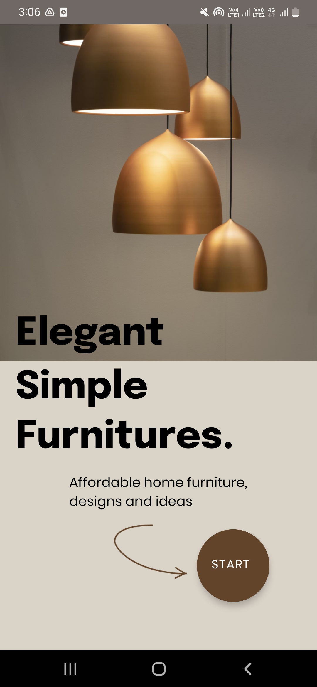
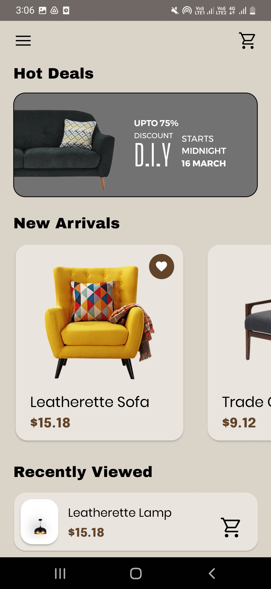
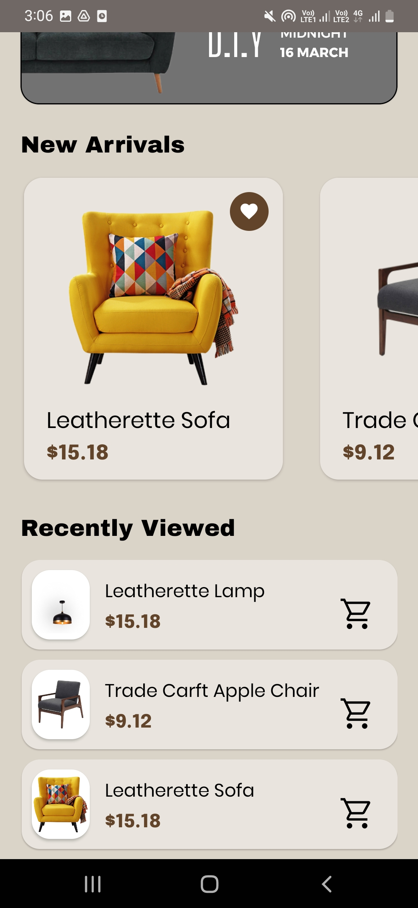
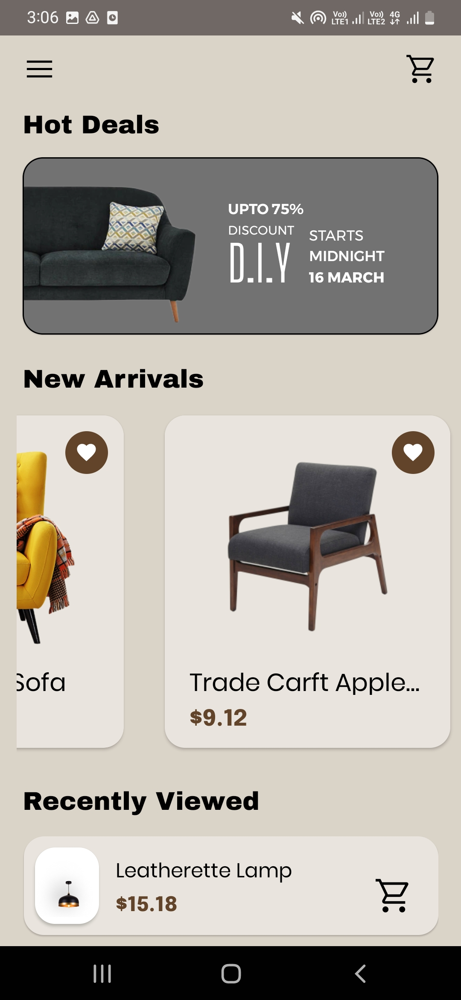
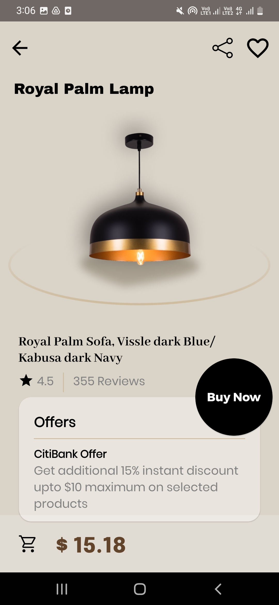

# Furniture-App

## What you should know
1. Android basics (project structure, how to make hello world! app )
2. Java Basics

## What this app contains
1. Splash Screen.
2. Home Screen with multiple recyclerViews.
3. Displaying Information in recyclerView.
4. Product Information Screen

## Techniques
RecycleView, ToolBar, CardView, ListView, NestedScroll, DrawerLayout, Floating Action Button, Fragments etc.

## Developed By
* Author : Aman Pandey
* Email  : amanpandey12398@gmail.com

Here are some screenshots of app

For further clarfications or doubts you can connect with me at amanpandey12398@gmail.com 
